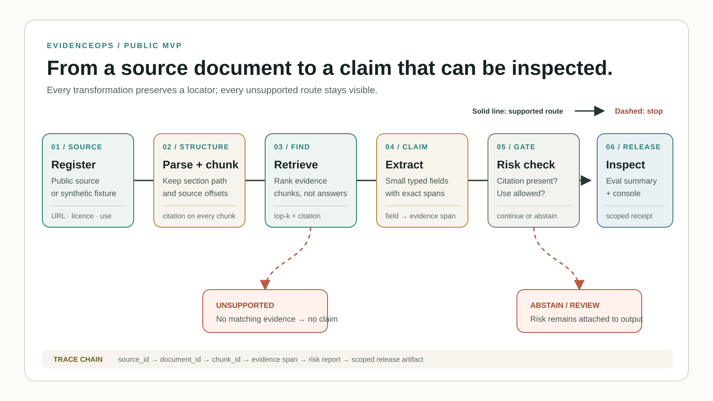

# EvidenceOps Public MVP

An evidence-first retrieval and release workflow built from public or clearly
labelled synthetic inputs. The project keeps source identity, citation
metadata, extraction evidence, risk flags, evaluation scope, and failure
analysis attached to every stage instead of treating a generated answer as the
final product.

## Public surfaces

- [Repository](https://github.com/alex051107/evidenceops-public-mvp)
- [Static Evidence Console](https://alex051107.github.io/evidenceops-public-mvp/)

The GitHub Pages surface is a static console generated from
`public/evidenceops-data.json`. It presents evidence cards, citations, risk
flags, evaluation summaries, and failure/ablation summaries. The dynamic
`/api/search` route exists in the local demo server; the static site is not a
claim that this backend is deployed.

## Workflow at a glance



The solid route shows how a source-bound evidence item reaches the inspectable
console. The two dashed branches are equally important outputs: retrieval can
return `unsupported`, and a risk check can stop a candidate claim or send it
for review. The figure describes the implemented public MVP; it does not imply
that the static Pages console is a deployed dynamic backend.

## Implemented pipeline

```text
public-source registry
  -> synthetic/public document ingestion
  -> structure-preserving parse
  -> citation-bearing chunks
  -> lexical retrieval with unsupported fallback
  -> small-schema extraction with evidence spans
  -> source-aware risk checks
  -> project-local gold set and scoring
  -> failure taxonomy and top-k ablation
  -> local API + generated static console
```

The repository contains the Day 0-Day 12 implementation and its artifacts:

1. source and license decisions;
2. document-card validation and ingestion;
3. parsing and citation-aware chunking;
4. lexical retrieval with an explicit unsupported result;
5. rule-based structured extraction with evidence spans;
6. source-aware risk checks;
7. a small, versioned project-local gold set;
8. scoring, failure taxonomy, and retrieval top-k ablation;
9. a local Web/API demo, Dockerfile, Render blueprint, and static Pages build.

## Quick start

Run these commands from the repository root:

```bash
python3 scripts/validate_public_sources.py
python3 scripts/ingest_sample_documents.py
python3 scripts/parse_documents.py
python3 scripts/chunk_documents.py
python3 scripts/search_chunks.py --query "source license synthetic citation" --top-k 5
python3 scripts/extract_fields.py
python3 scripts/risk_check.py \
  --search-result data/processed/search_result.json \
  --intended-use project_demo \
  --output data/processed/risk_report.json
python3 scripts/build_gold_set.py
python3 scripts/score_eval.py
python3 scripts/analyze_failures.py
python3 scripts/build_static_site.py
python3 -m unittest discover -s tests -v
```

Start the local dynamic demo:

```bash
python3 scripts/run_demo_server.py --host 127.0.0.1 --port 8765
```

## Repository map

| Path | Purpose |
| --- | --- |
| `data/source_registry.csv` | Public-source identity, license, access method, and use decision. |
| `data/processed/` | Deterministically generated document, chunk, retrieval, extraction, and risk artifacts. |
| `data/eval/` | Small project-local gold sets, score report, failure taxonomy, and ablation report. |
| `src/evidenceops_public/` | Parser, chunker, retriever, extractor, risk checker, evaluator, and static-site modules. |
| `scripts/` | Reproducible command-line entry points for each pipeline stage. |
| `tests/` | Focused regression tests for the implemented contracts. |
| `public/` | Static Evidence Console and its generated public data bundle. |
| `docs/` | Source decisions, execution notes, deployment guide, usage protocol, and self-reviews. |

## Acceptance boundary

The project requires that:

- every source has a URL, license, access method, and use decision;
- every sample document preserves source, license, and synthetic status;
- chunks retain citation metadata;
- retrieval emits `unsupported` instead of inventing an answer;
- extracted fields carry an evidence span and citation;
- reported metrics include the dataset size and remain scoped to the bundled
  small gold set;
- risk checks remain project guardrails, not legal, medical, privacy, or
  regulatory determinations.

## Honest scope

This is a public portfolio MVP. It does not use real patient records or private
LiGaMD logs, and it does not claim a real customer, internship, production
deployment, high-concurrency distributed system, ChEMBL-scale ingestion, legal
compliance, clinical correctness, or production-quality retrieval metrics.

The static site demonstrates a read-only presentation layer. A local test,
Dockerfile, deployment blueprint, or Pages URL does not by itself establish a
live dynamic backend, reliability under production traffic, or user impact.

## 中文说明

这是 EvidenceOps 的公开数据优先版本。它已经实现公开来源登记、解析、带
citation 的切块与检索、小 schema 抽取、风险检查、小型项目内评测、失败分析、
本地 API 和静态 Evidence Console。公开网页目前是静态展示层；动态
`/api/search` 仍是本地 demo，不能写成已经完成生产部署。

仓库不使用真实患者数据，也不把 synthetic 文档写成真实客户材料。所有评测
数字只对仓库内的小型 gold set 有效，不能外推为生产质量、法律/医疗合规或真实
用户效果。
